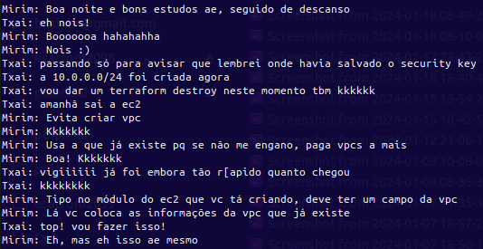
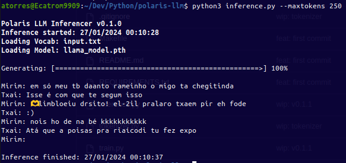

<h1 align="center">Tech Tweakers - Polaris LLM </h1>
<p align="center"><i>Learning project to build a Llama LLM model from scratch based on "Llama from Scratch" by Brian Kitano.</i></p>

<div align="center">
  <a href="https://github.com/Tech-Tweakers/polaris-llm/stargazers"></a>
<a href="https://github.com/Tech-Tweakers/polaris-llm/network/members"></a>
<a href="https://github.com/Tech-Tweakers/polaris-llm/pulls"></a>
<a href="https://github.com/Tech-Tweakers/polaris-llm/issues"></a>
<a href="https://github.com/Tech-Tweakers/polaris-llm/graphs/contributors"></a>
<a href="https://github.com/Tech-Tweakers/polaris-llm/blob/master/LICENSE"></a>
</div>

<br>
<p align="center"><i>Got problems or have some time to help? Please open an <a href="https://github.com/Tech-Tweakers/polaris-llm/issues/new">Issue</a> to tell us!</i></p>

# About

Polaris LLM is a custom language model developed using PyTorch. This project encompasses scripts for training the model on a character-level dataset and executing inference with the trained model. The development of Polaris LLM serves educational purposes and is based and inspired by the [Llama from Scratch](https://blog.briankitano.com/llama-from-scratch/) blog post by Brian Kitano.

# Latest Inference

- Original Input & Latest Inference

 

## Overview

Polaris LLM demonstrates the process of building a language model from the ground up, showcasing the intricacies of model architecture and training. It provides hands-on experience with advanced concepts in natural language processing and deep learning.

The training script (train.py) uses PyTorch to train a language model named 'Llama', which incorporates advanced techniques like RoPE (Rotary Positional Embeddings) and SwiGLU activations.

The inference script (inference.py) is designed to load the trained 'Llama' model and generate predictions based on input text.

## Getting Started

### Prerequisites
- Python 3.x
- PyTorch
- NumPy
- Pandas 
- Matplotlib

### Installation

Clone the repository to your local machine:

```bash
git clone https://github.com/Tech-Tweakers/polaris-llm.git
cd Polaris-llm
```

### Training the Model

1 - Prepare your dataset: The dataset should be a text file where the text data is used for training the model. The input file should be placed in the root directory. In the **Makefile** there is some functions to improve the dataset, like removing special characters, strings, etc.

2 - Run the training script: The training script will train the model and save the trained model to the models directory. The script will also save a checkpoint of the model after each epoch. The checkpoint files are used to resume training if the training process is interrupted.

```bash
python train.py
```

### Inference

After training, use the inference.py script for generating text:

1 - Load the trained model: Ensure that the trained model .pth file is accessible to the script.

2 - Run the inference script:

```bash
python inference.py
```

## Dataset and Vocabulary

The dataset file used for training **must be the same file** to be used for the Vocabulary. The Vocabulary is generated from the dataset file and is used to encode the text data into integers. If you train the model on one dataset and then try to use a different Vocabulary for inference, the model will not be able to decode the text data.

## Components

### Training Script (train.py)

- **Character-Level Tokenization**: Splits the text into characters and encodes them as integers.
- **Model Architecture**: Defines the 'Llama' model along with its subcomponents like RoPEMaskedMultiheadAttention and SwiGLU.
- **Training Loop**: Iteratively trains the model, saves checkpoints, and monitors performance metrics.

### Inference Script (inference.py) - Under Development!

- **Model Loading**: Loads the trained 'Llama' model from a **.pth** file.
- **Tokenization and Encoding**: Converts input text into the model-readable format.
- **Text Generation**: Generates output text based on the input provided.

## Customization

You can customize various aspects of the training and inference process:

- **Model Parameters**: Adjust the **MASTER_CONFIG** in both scripts to change model dimensions, layer counts, etc.
- **Dataset**: Replace **input.txt** with your dataset file for training on different text data.
- **Vocabulary**: The same file used for the dataset should be used for the Vocabulary creation.

## Contributing

Contributions to Polaris LLM are welcome. Please read CONTRIBUTING.md for guidelines on how to contribute.

## License

This project is licensed under the MIT License - see the LICENSE file for details.

## Sources

https://github.com/bkitano/llama-from-scratch

https://blog.briankitano.com/llama-from-scratch/

## Acknowledgments

Special thanks to **Brian Kitano** for his insightful Jupiter Notebook, **OpenAI's ChatGPT**, and **GitHub Copilot** for their invaluable assistance and guidance in the development of this project. These AI tools, alongside Brian's foundational work, have significantly contributed through code suggestions, debugging, and providing insights into best practices in machine learning and software development. Their collaborative aid **underscores a remarkable blend of human creativity and AI efficiency**, illustrating the spirit in technological advancement and innovation.